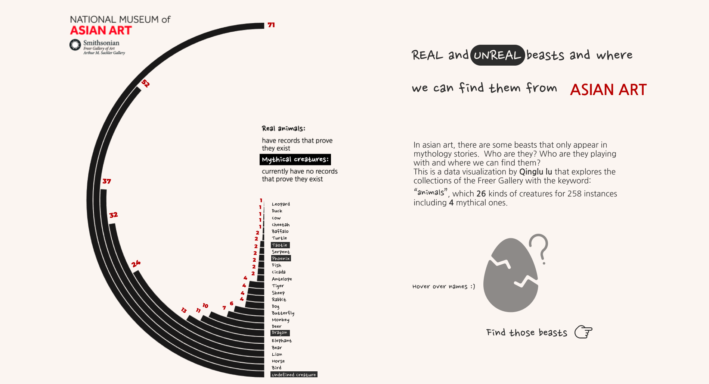

## Topic:
The topic of my quantitative project is Real and unreal beasts and where we can find them from Asian art.
## Data: 
All my datasets are from collections of the Freer Gallery, national museum of asian art. After searching the keyword "animals" I got 258 instances
Due to the relatively small amount of data, I want to take this opportunity to try multiple data visualization methods by answering three different questions.

-The frequency of each animal
-What if there are some artworks that have multiple animals? Anything fun?
-What the medium of those artworks?

And I manually created the required data, created new variables such as "animals", "main medium" and "medium details" because the classification of the medium in art history is particularly detailed. ink on paper, color on paper bla bla, hard to categorize, and visualize scattered data.

[Click here for the original data](data_0926.csv)

## Desigin：
#### Sketch:
My design idea is to pursue a childish style, because I have been questioning the meaning of this project and the targeted audience, so I added some animal icons, suggested by Richard.  My plan is to add hover over effects and many annotations, all in a hand-drawn style. try to make it fun to explore. I am strongly inspired by the work, why do cats and dogs by google. The author also introduced her working process in detail, and I found some useful libraries.

#### Color and Font：
With the theme of kiddish, I combined decorative font with san serif font together. Also I try to mimic the pencil sketch and paper texture. So for the colors, I darkened the white background I bit and add a grey tone to the vivid color pallate. 

#### Iterations:
It is made through Figma. which mainly answer three questions.and each of them have interactive features that let the users of this chart to explore. 
1. How may animals are there? use radical bar chart.

hover over the name of each animals, the right bottom icon will change, and click it can direct you to the original smithsonian collections.

2. Who are they playing with? use chord diagram.
All the mythical creatures are not standing alone, they all appeared with real animals together. such as dragon and lion always appear in pairs. So ideally, when you hover over icons, you can find some more intro about the mythical creatures. The thicker the ribbons in between, the more frequency the pairs appeared together in art.

3. Where we can find them? Sunburst chart.
Here I use the medium data and their subcategories. When you hover over, a tooltip will pop up to inform you the number and composition of the artworks' medium of a specific animals.

#### Prototype:
[Click here](https://www.figma.com/proto/kl3unlO3df8vVQS01s8jA9/major-studio1_real-and-unreal-animals?node-id=162%3A112&viewport=-3110%2C-799%2C0.4209572672843933&scaling=min-zoom)

## Programming:
Pretty much done with the webpage without some of the interactive features. 
#### Next step:
take a look at the d3 tutorial and add interactive features. Figure out my annotations, And I use existing icons in my design, as well as the content of the animal intro, I need to add references and proofread the content.

